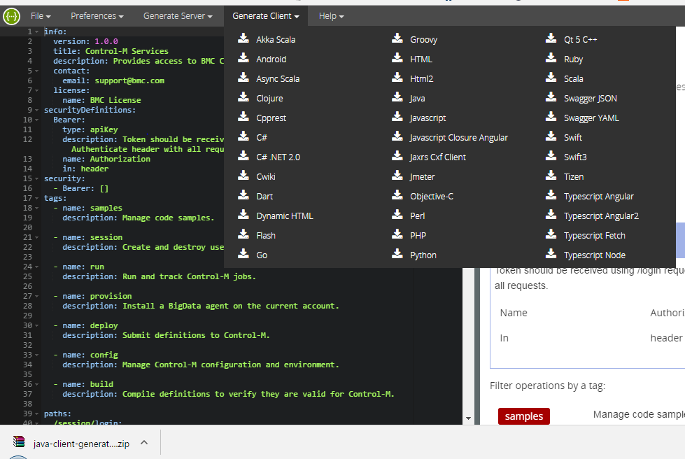

DISCLAIMER: This code is working with version 3 (the next upcoming version), not with version 2 (current released version)

## JUnit Control-M job using the automation api
How to build JUnit which use REST automation-api call to run and monitor jobs

**ENDPOINT** - Control-M endpoint   
**USER** - Control-M user account for automation  
**PASSWORD** - Control-M account password for automation  

```java
        // create connection to automation-api server
		conn = new Connection(ENDPOINT);
		conn.login(USER, PASS);
		// run the job file definition
		rs = new RunService(conn).runJobs("/home/reports/startProduceEnd2016reports.json");
		// check if specific job ended (within 15seconds) successfully
		boolean isEnded = rs.waitForJobToEnd("end2016eu",15*1000).isJobStatus("end2016eu",JobStatus.ENDED_OK);
		Assert.assertTrue(isEnded);
```

##### Executing this example
1.  Generate a REST client (see next section)
2.  Change the USER, PASS and AUTOMATION_API_ENDPOINT in the code to use your connection parameters
3.  Change the example jobs (.json) in /resource to use your Control-M Server and agent (usually the same of the hostname where Control-M is installed)
2.  Use maven to build this project
Build project using maven from the home directory (where pom.xml reside)
```bash
mvn package 
```
   

##### Generate REST client
To Generate the REST client classes use the [Swagger generator](http://editor.swagger.io/#/), for java:
1. Copy the YAML file content (locate in ENDPOINT/yaml) into the [Swagger editor](http://editor.swagger.io/#/)
2. Generate the client (a zip file).
3. Extract the zip file to a temp folder
<p align="center">
  
</p> 
4. Build the project using maven (mvn install), it will add the jar to your local maven repository


See the [Automation API - Services](https://docs.bmc.com/docs/display/public/workloadautomation/Control-M+Automation+API+-+Services) documentation for more information.  
See the [Automation API - Code Reference](https://docs.bmc.com/docs/display/public/workloadautomation/Control-M+Automation+API+-+Code+Reference) documentation for more information.
