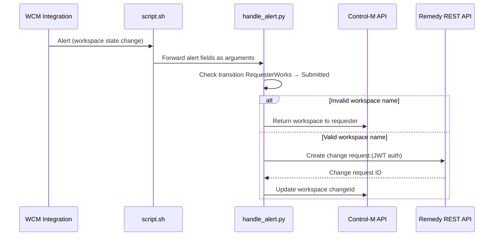

# Control-M WCM Integration → BMC Remedy

This example connects **Control-M Workspace Change Management (WCM) Integration alerts** to **BMC Remedy ITSM**. When a user submits a workspace for approval, the integration automatically opens a Remedy change request and writes the ticket ID back to the workspace in Control-M.

## How it works



### Trigger condition

`handle_alert.py` acts only when all of the following are true:

| Field | Expected value |
|---|---|
| `oldState` | `RequesterWorks` |
| `newState` | `Submitted` |
| `changeId` | empty or `N/A` |

If the workspace name does **not** start with `Workspace`, the handler returns the workspace to the requester with a validation message instead of opening a ticket.

## Project layout

| File | Purpose |
|---|---|
| `script.sh` | Entry point configured in WCM Integration; logs the alert and calls the Python handler |
| `handle_alert.py` | Parses the alert, calls Control-M and Remedy APIs |
| `remedy_client.py` | Remedy JWT authentication and change-request creation |
| `settings.json` | Control-M Automation API endpoint and API key |
| `itsm_config.json` | Remedy connection settings and default ticket field values |
| `requirements.txt` | Python third-party dependencies |

Logs are written to `logs/handle_alert.log`. Raw alert payloads are appended to `log.out` by `script.sh`.

## Prerequisites

- Control-M SaaS (or compatible environment) with **WCM Integration** enabled
- A Control-M **Automation API** key with permissions to list/update workspaces
- BMC Remedy with the **REST API** enabled and a service account that can create change requests
- Python **3.9+** and `pip`
- A Linux/Unix shell to run `script.sh` (or WSL on Windows)

## Installation

1. Copy this folder to the machine that will receive WCM Integration alerts.

2. Install Python dependencies:

```bash
pip install -r requirements.txt
```

3. Make the shell script executable:

```bash
chmod +x script.sh
```

## Configuration

### Control-M — `settings.json`

```json
{
    "endpoint": "https://<your-controlm-host>/automation-api",
    "apiKey": "<your-api-key>"
}
```

| Key | Description |
|---|---|
| `endpoint` | Control-M Automation API base URL (no trailing slash) |
| `apiKey` | API key used for workspace list/update calls |

### Remedy — `itsm_config.json`

```json
{
    "remedy_base_url": "https://<remedy-host>:<port>/api/arsys/v1",
    "remedy_form": "CHG:ChangeInterface_Create",
    "username": "<remedy-user>",
    "password": "<remedy-password>",
    "verify_ssl": true,
    "ticket_defaults": {
        "First Name": "App",
        "Last Name": "Admin",
        "Impact": "4-Minor/Localized",
        "Urgency": "4-Low",
        "Location Company": "Calbro Services",
        "Detailed Description": "Automatic ticket from Control-M WCM Integration.",
        "ASCPY": "Calbro Services",
        "ASORG": "IT Support",
        "ASGRP": "Backoffice Support",
        "ASCHG": "Mary Mann",
        "ASLOGID": "Mary"
    }
}
```

| Key | Description |
|---|---|
| `remedy_base_url` | Remedy AR System REST API base URL |
| `remedy_form` | Form used to create changes (default: `CHG:ChangeInterface_Create`) |
| `username` / `password` | Remedy credentials for JWT login |
| `verify_ssl` | Set to `false` only for lab environments with self-signed certificates |
| `ticket_defaults` | Default field values sent when creating the change request |

Adjust `ticket_defaults` to match your Remedy environment (company, support group, assignee, etc.).

> **Security:** Do not commit real credentials. Restrict file permissions on `itsm_config.json` and `settings.json`.

## Connect WCM Integration to this handler

In the Control-M **WCM Integration** alert configuration, point the alert action to `script.sh`:

1. Open WCM Integration settings in Control-M.
2. Configure an alert for workspace state changes (or use the existing WCMOS/WCM alert template).
3. Set the **handler script** to the full path of `script.sh`, for example:

```
/opt/wcm-listener/script.sh
```

4. Ensure the Control-M integration service can execute the script and that `python3` is on the `PATH` used by that service.

When an alert fires, WCM Integration invokes the script with the alert fields as arguments in `key: value` form, for example:

```
changeId: N/A ctmRequestId: 12345 name: Workspace-MyJob oldState: RequesterWorks newState: Submitted endUser: jdoe
```

`script.sh` forwards those arguments unchanged to `handle_alert.py`.

## Manual test

You can simulate an alert without waiting for WCM Integration:

```bash
./script.sh \
  "changeId: N/A" \
  "ctmRequestId: 12345" \
  "name: Workspace-TestJob" \
  "oldState: RequesterWorks" \
  "newState: Submitted" \
  "endUser: jdoe"
```

Check `logs/handle_alert.log` for processing details and confirm that:

1. A change request was created in Remedy.
2. The workspace `changeId` was updated in Control-M.

Alerts that do not match the trigger condition are logged and ignored:

```bash
./script.sh "oldState: Draft" "newState: RequesterWorks" "name: Workspace-TestJob"
```

## Troubleshooting

| Symptom | Things to check |
|---|---|
| Script not invoked | WCM Integration handler path, script execute permission, service account |
| `Control-M endpoint/apiKey missing` | `settings.json` values and file location next to `handle_alert.py` |
| `ITSM config not found` | `itsm_config.json` exists in the same folder as `remedy_client.py` |
| Remedy auth failure | Username/password, Remedy REST API URL, SSL settings |
| Remedy create failure | `ticket_defaults` field names/values for your Remedy form |
| Workspace not updated | API key permissions, workspace name match, Control-M endpoint reachability |
| Workspace returned instead of ticket opened | Workspace name must start with `Workspace` |

Raw alert payloads are always appended to `log.out` for debugging.
